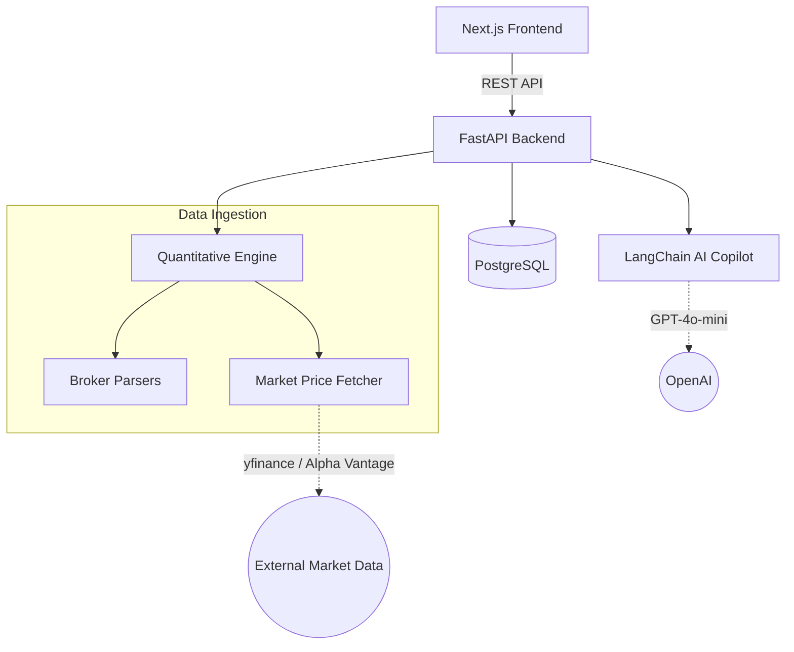

# FinTrace Architecture

FinTrace is designed as a modern, decoupled web application.

## High-Level Diagram

## Stack Details

### Frontend
- **Framework**: Next.js 14 (App Router)
- **Styling**: Tailwind CSS, Shadcn UI components
- **Charting**: Recharts for rendering equity curves and risk analytics

### Backend
- **Framework**: FastAPI (Python 3.11+)
- **ORM**: SQLAlchemy 2.0 with Alembic for migrations
- **Background Tasks**: APScheduler for asynchronous pricing updates
- **AI Core**: LangChain `create_sql_agent` with isolated temporary SQLite contexts

### The "Chronology-First" Philosophy
A core tenet of the FinTrace architecture is the chronology-first transaction ledger. Every import is sequentially ordered by execution date, and sequence numbers are generated to break ties. This guarantees that capital gains (FIFO) and performance (XIRR) modules produce reproducible, deterministic results.
